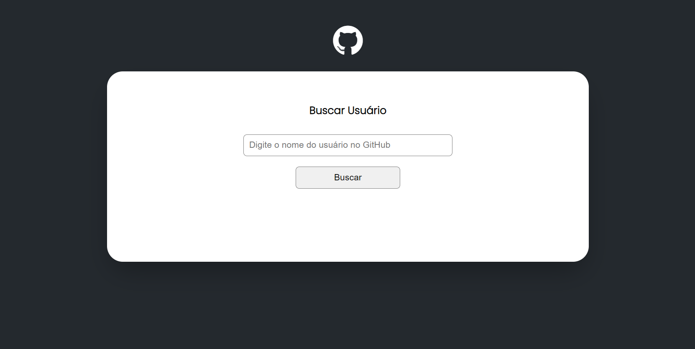

# GitHub API

O propósito desta aplicação é exibir dados do usuário após informar o nome.

Dados como:
- Nome;
- Bio;
- Seguidores e Seguindo;
- Repositórios;
- Eventos;

***
*Projeto de Fetch e API do GitHub utilizando JavaScript.*

***
## Quer rodar esse projeto no seu computador?
- Para clonar/baixar esse projeto, siga as solicitações do GitHub.
- Usar um editor de código de sua preferência para abrir o projeto.
- Passando o comando "npm install" no terminal, será instalados os pacotes que foram utilizados.